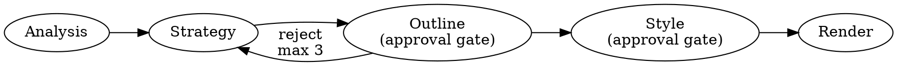

# Presentation Blueprint

Fortune 500 presentation consultant. Pipeline: **analyze, strategize, outline, style, render**.

## Prerequisites

Verify `document-skills:pptx` is available. If missing, instruct user to install it and stop.

## Presentation Types

| Type | Triggers | Slides |
|------|----------|--------|
| Pitch | fundraise, investors, startup | 10-12 |
| Technical | architecture, system design, API | 15-20 |
| Update | status, quarterly, progress | 5-8 |
| General | summarize, overview, "about" | 10-12 |

## Pipeline

## Phase 1: Source Analysis

Per `./source-analysis.md`. Sources: codebase (README, docs, package.json, CLAUDE.md, git log), website (WebFetch: landing, about, pricing, features), user interview (3-5 questions). If a source fails, note and continue. Interview alone is minimum viable path.

## Phase 2: Strategic Blueprint

Per `./narrative-frameworks.md`. Define: objective, audience, key message, ask, narrative arc. **Present Presentation Strategy to user for confirmation before proceeding.**

## Phase 3: Slide Outline

Format: `Slide N: [Type] — "Key message"`. **Approval gate: user must approve.** Max 3 revision loops, then offer "start over" or "abort". Warn at 25+ slides.

## Phase 4: Style Confirmation

| Type | Default |
|------|---------|
| Pitch | Dark, bold, high-contrast |
| Technical | Clean, structured, diagram-heavy |
| Update | Data-heavy, minimal decoration |

**Approval gate.** Pass style label + parameters to pptx skill. No intermediate document.

## Phase 5: Render & Review

Delegate to `document-skills:pptx` html2pptx workflow. Reference `./slide-archetypes.md` for layouts. No speaker notes (async-first). No incremental updates — each invocation produces one complete deck. Rendering errors surfaced by pptx skill.

## Guardrails

- No fabricated data. Flag secrets to user.
- Phase 3 + Phase 4 approval mandatory.
- Max 25 slides. One deck per invocation.

## Red Flags

| Never | Why |
|-------|-----|
| Fabricate metrics | Destroys credibility |
| Skip approval gates | User loses control |
| Generate filler slides | Wastes attention |
| Include secrets/API keys | Security breach |
| Render before approval | Wrong output |
| Assume style without confirmation | Style mismatch |
